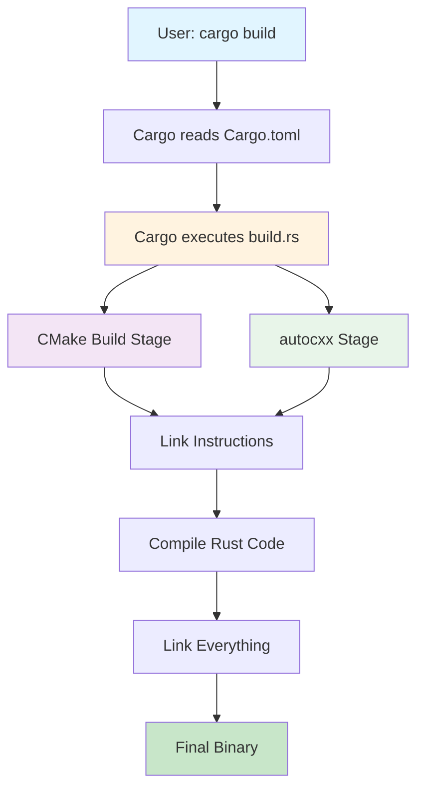
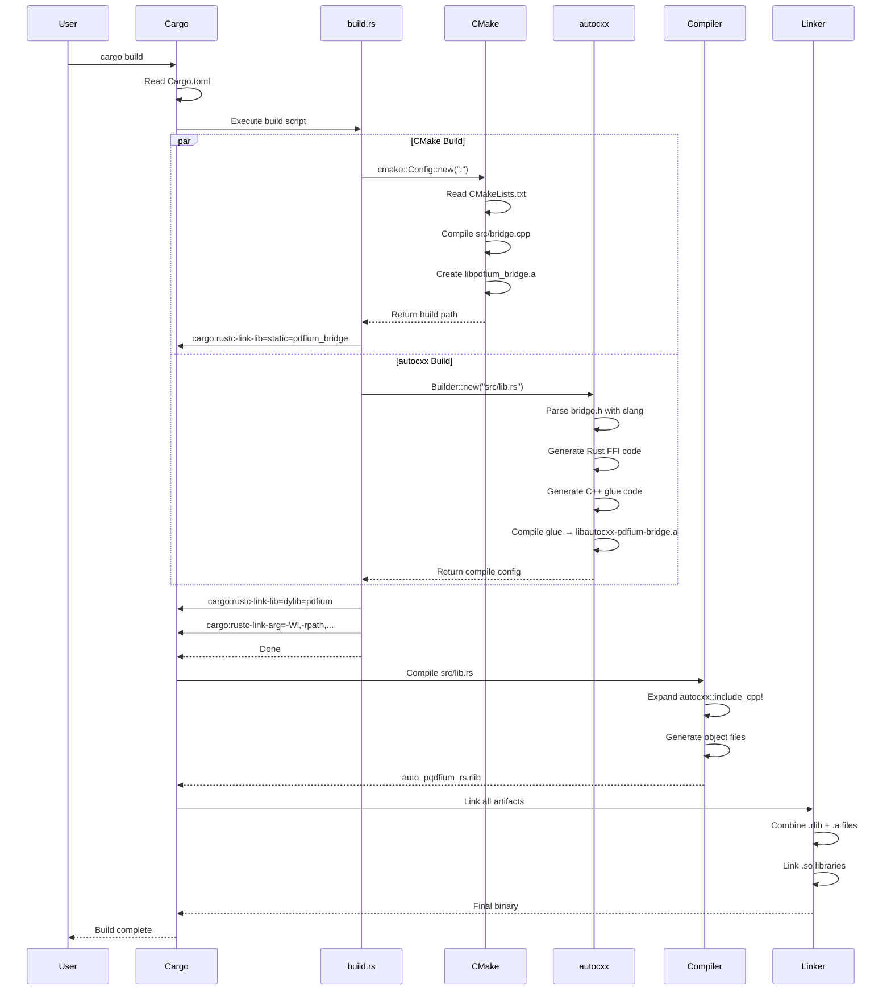
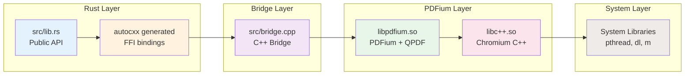
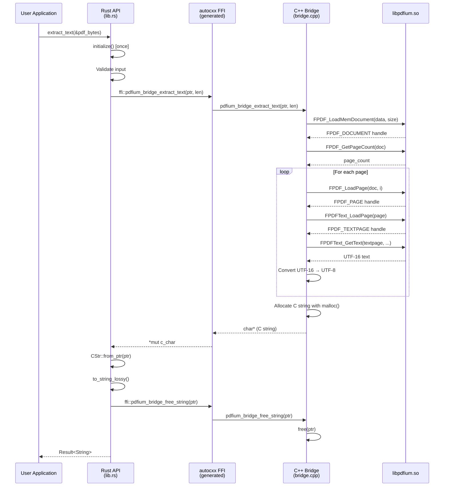
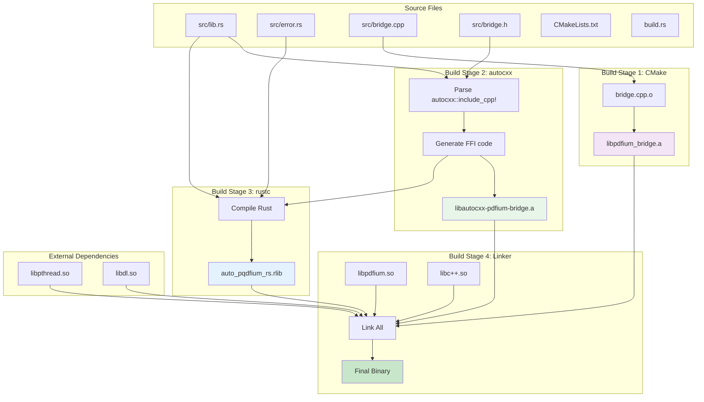
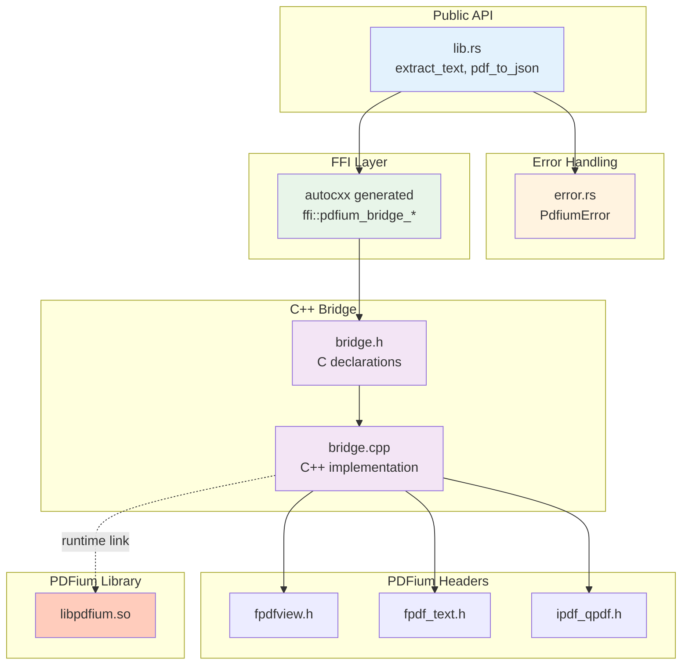
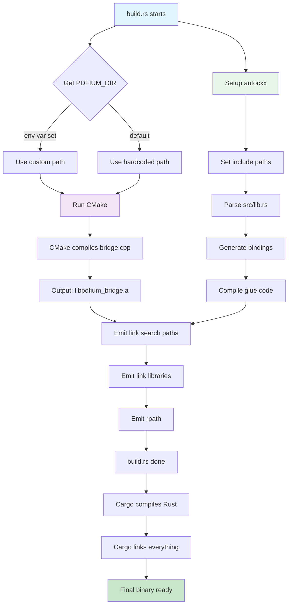
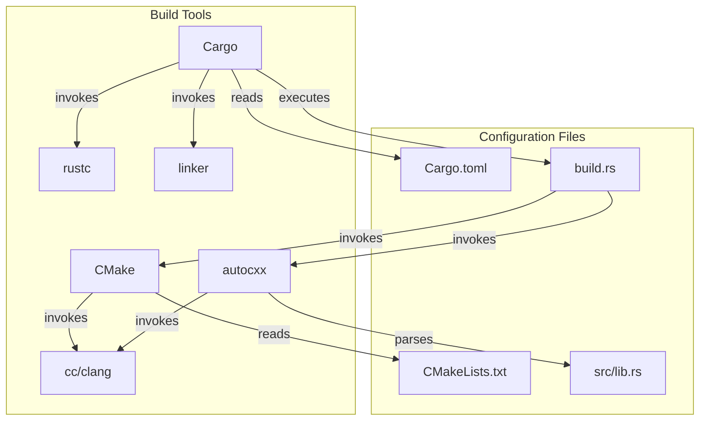

# Build System Diagram (Mermaid)

You can view this diagram by pasting it into [Mermaid Live Editor](https://mermaid.live/) or viewing on GitHub.

## High-Level Build Flow

## Detailed Build Process

## Component Architecture

## Runtime Call Flow

## Build Artifacts & Dependencies

## File Dependencies Graph

## Build Configuration Flow

## Linker Resolution Order

## Build System Interaction Matrix

